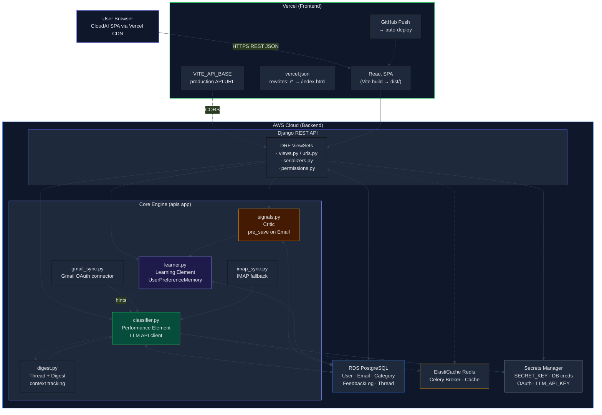
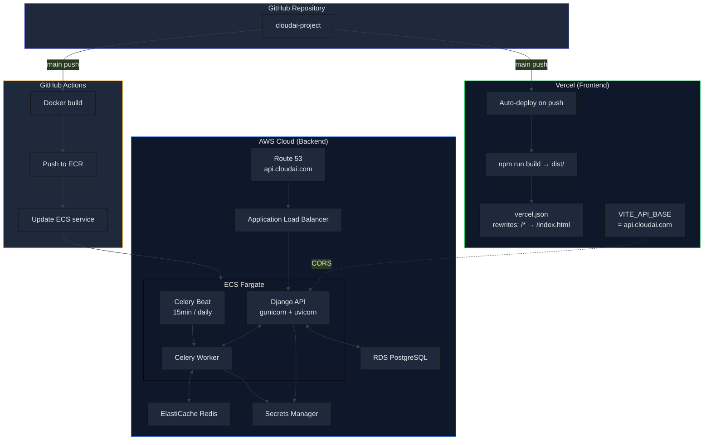
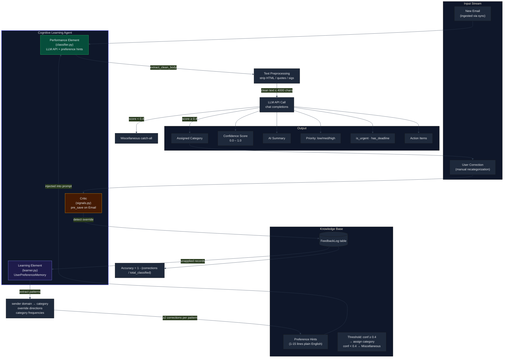
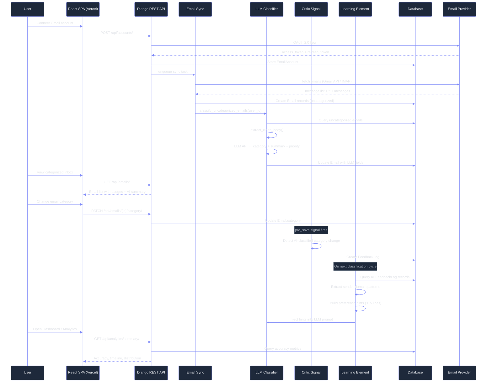
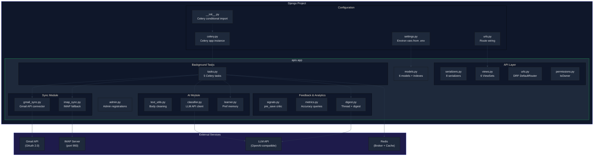
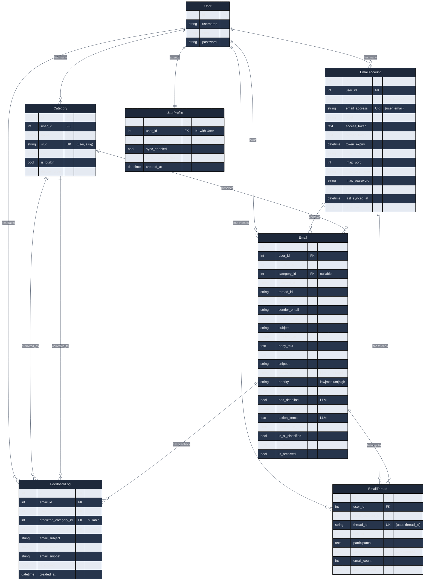
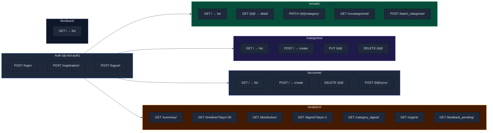
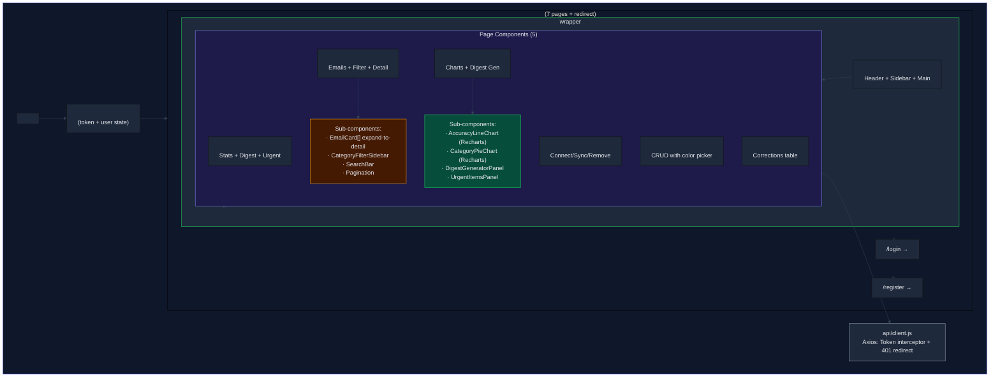
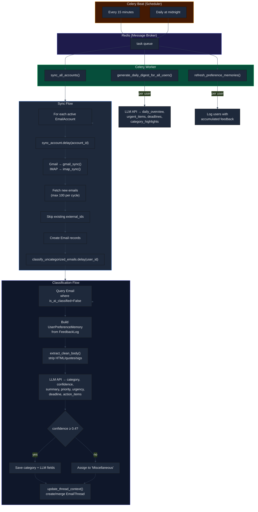
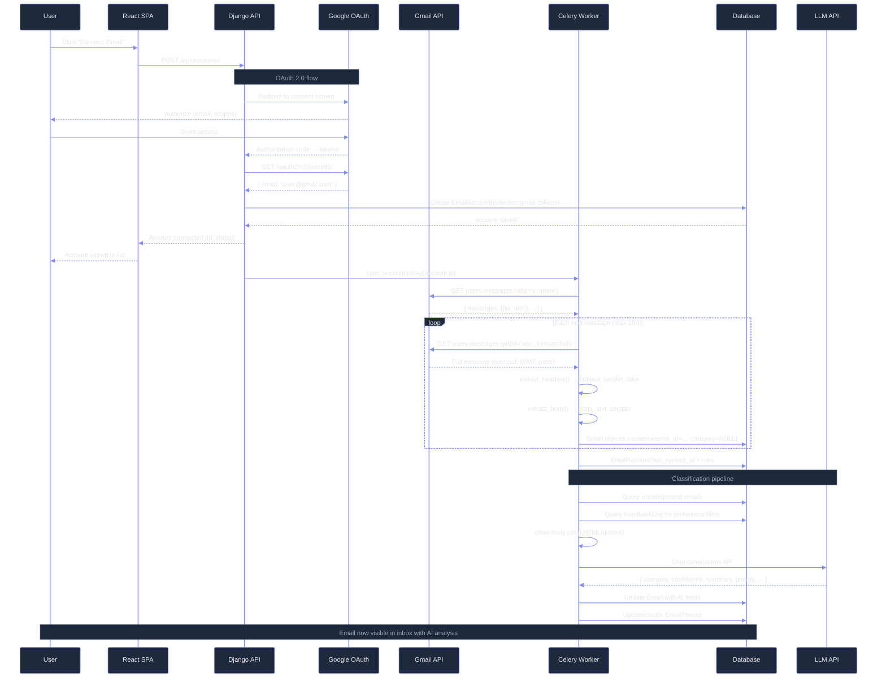

# CloudAI — System Architecture Diagrams

> Mermaid diagrams explaining the full platform architecture: React SPA on Vercel, Django API on AWS, AI agent loop, and data flows.

---

## Table of Contents

1. [Overall System Architecture](#1-overall-system-architecture)
2. [Deployment Topology](#2-deployment-topology)
3. [AI Cognitive Agent Architecture](#3-ai-cognitive-agent-architecture)
4. [Email Data Flow (End-to-End)](#4-email-data-flow-end-to-end)
5. [Backend Component Architecture](#5-backend-component-architecture)
6. [Database Entity-Relationship Diagram](#6-database-entity-relationship-diagram)
7. [REST API Route Map](#7-rest-api-route-map)
8. [Frontend Component Tree](#8-frontend-component-tree)
9. [Celery Task & Scheduling Flow](#9-celery-task--scheduling-flow)
10. [Gmail OAuth & Sync Sequence](#10-gmail-oauth--sync-sequence)

---

## **1. Overall System Architecture**

> 🌐 **Architecture**: React SPA on Vercel → Django API on AWS



### Services Summary

| Provider | Service | Purpose | Est. Cost |
|---|---|---|---|
| **Vercel** | Edge CDN + auto-deploy | Host React SPA, GitHub integration | Free (Hobby) |
| **AWS** | ECS Fargate | Django + Celery containers | ~$15-30/mo |
| **AWS** | RDS PostgreSQL | Production database | ~$15/mo |
| **AWS** | ElastiCache Redis | Celery broker + cache | ~$13/mo |
| **AWS** | Secrets Manager | Encrypted secrets | ~$0.40/mo |
| **AWS** | Route 53 | DNS (api.cloudai.com) | ~$0.50/mo |
| **Total** | | | **~$45-60/mo** |

---

## **2. Deployment Topology**

> 🚀 **CI/CD**: Vercel auto-deploys frontend; GitHub Actions deploys backend



---

## **3. AI Cognitive Agent Architecture**

> 🤖 **Agent theory**: Performance Element → Critic → Learning Element



### Agent Theory Mapping

| Concept | CloudAI Implementation |
|---|---|
| **Performance Element** | `EmailClassifier` — LLM API (OpenAI-compatible) |
| **Critic** | `pre_save` signal on `Email` model |
| **Learning Element** | `UserPreferenceMemory` — pattern extraction |
| **Knowledge Base** | `FeedbackLog` table + preference hints |
| **Performance Standard** | Confidence threshold: 0.4 |
| **Environment** | User's inbox (Gmail/IMAP/Outlook) |

---

## **4. Email Data Flow (End-to-End)**

> ⏱ **Pipeline**: Connect → Sync → Classify → Review → Learn



---

## **5. Backend Component Architecture**

> 🏗️ **Module layout**: Django project with `apis` app + Celery workers



### Module Dependency Map

```
tasks.py
  ├── gmail_sync.py → models.py
  ├── imap_sync.py  → models.py
  ├── text_utils.py (lazy import)
  ├── classifier.py → models.py, text_utils.py
  │                 └── settings.py (LLM_API_URL, KEY, MODEL)
  ├── digest.py     → models.py, classifier.py (LLM call)
  └── learner.py    → models.py (FeedbackLog, Category)

signals.py → models.py (pre_save on Email)
metrics.py → models.py (Email, FeedbackLog)
```

---

## **6. Database Entity-Relationship Diagram**

> 🗃️ **Data model**: 6 models, 5 indexes, 9 relationships



### Key Relationships

- **User → UserProfile**: One-to-one (SaaS extension)
- **User → EmailAccount**: One-to-many (multiple inboxes)
- **User → Category**: One-to-many (per-user categories)
- **User → Email**: One-to-many (all user emails)
- **EmailAccount → Email**: One-to-many (emails from one inbox)
- **Category → Email**: One-to-many (nullable, SET_NULL on delete)
- **Email → FeedbackLog**: One-to-many (correction history)
- **FeedbackLog → Category (×2)**: Predicted vs corrected
- **User → EmailThread**: One-to-many (thread context)

---

## **7. REST API Route Map**

> 🔌 **Endpoints**: 25 routes across 7 resource groups



| Group | Count | Auth | Auth Header |
|---|---|---|---|
| Auth | 3 | No | — |
| Emails | 5 | Yes | `Authorization: Token <key>` |
| Categories | 4 | Yes | Same |
| Accounts | 4 | Yes | Same |
| Analytics | 7 | Yes | Same |
| Feedback | 1 | Yes | Same |
| **Total** | **24** | | |

---

## **8. Frontend Component Tree**

> 🖥️ **UI hierarchy**: React 19 SPA with 7 protected routes



### Frontend Dependencies

```
react-router-dom  →  Routing + NavLink active-state
axios             →  HTTP with token interceptors
recharts          →  LineChart + PieChart (dark theme tooltips)
```

### CSS Architecture (modular)

```
index.css  →  Dark theme :root vars, reset, shared components (.badge, .btn-*, .form-*, .card, .modal-*)
App.css    →  Layout only: header, sidebar, main-content
Pages:
  LoginPage.css | DashboardPage.css | InboxPage.css
  AnalyticsPage.css | AccountsPage.css | CategoriesPage.css | FeedbackPage.css
```

---

## **9. Celery Task & Scheduling Flow**

> ⏰ **Background jobs**: Beat (15min/daily) → Redis broker → Worker executes



---

## **10. Gmail OAuth & Sync Sequence**

> 🔐 **Auth flow**: OAuth 2.0 consent → token exchange → initial sync → classification



---

## Legend

| Symbol | Meaning |
|---|---|
| `--▶` | Data flow / dependency |
| `--1:1--` | One-to-one relationship |
| `--o{` | One-to-many relationship |
| `(LLM)` | Field generated by LLM API |
| `[protected]` | Route behind `<ProtectedRoute>` |
