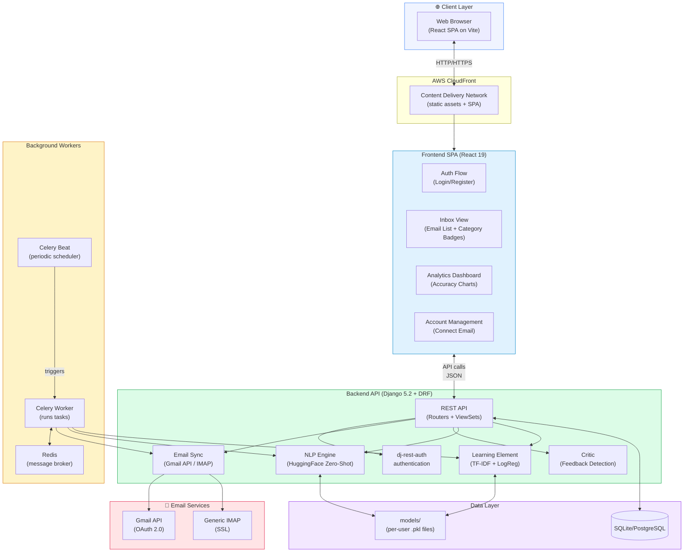
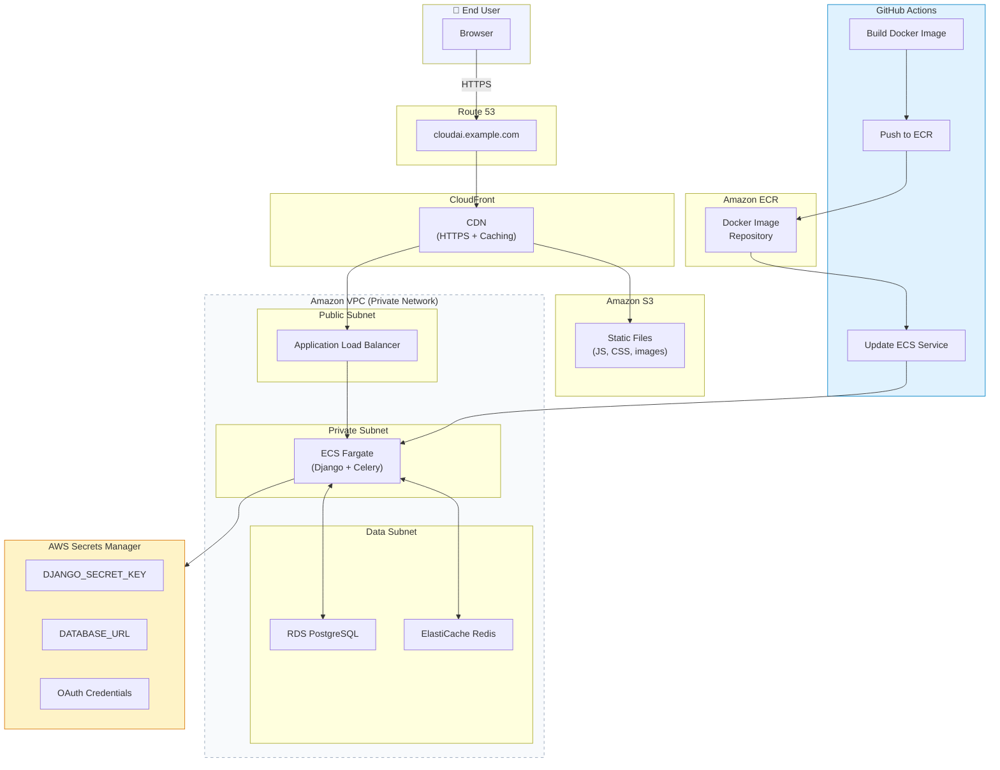
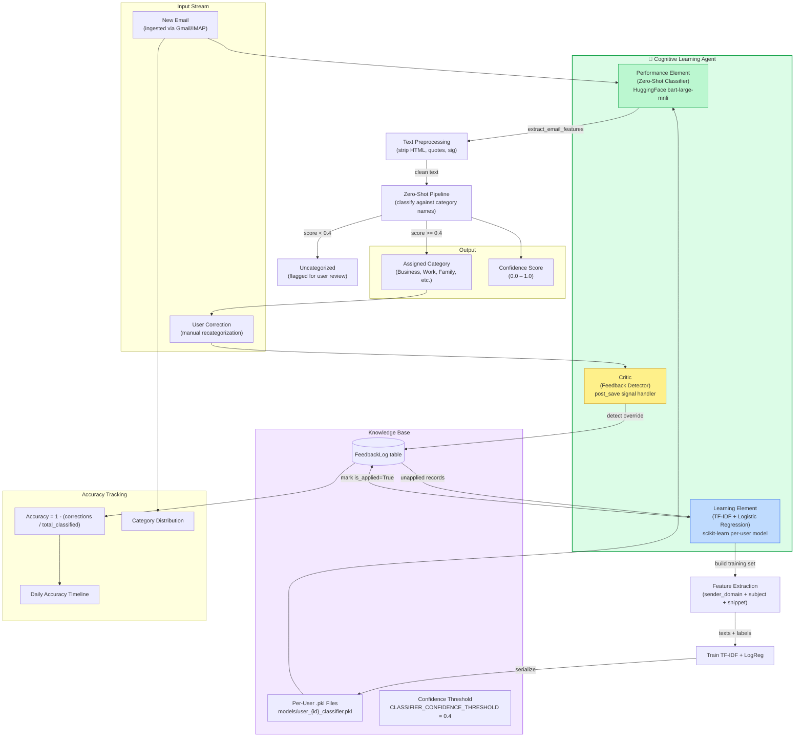
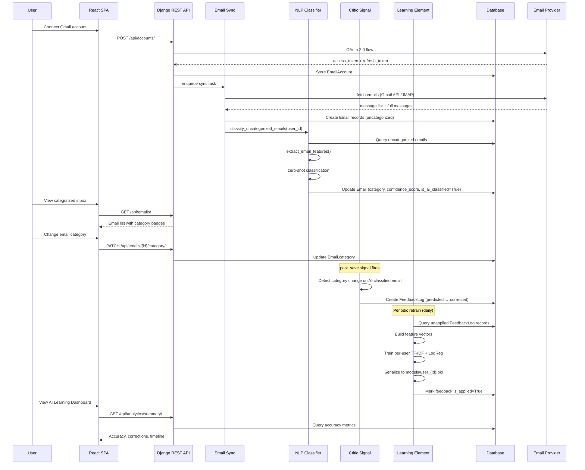
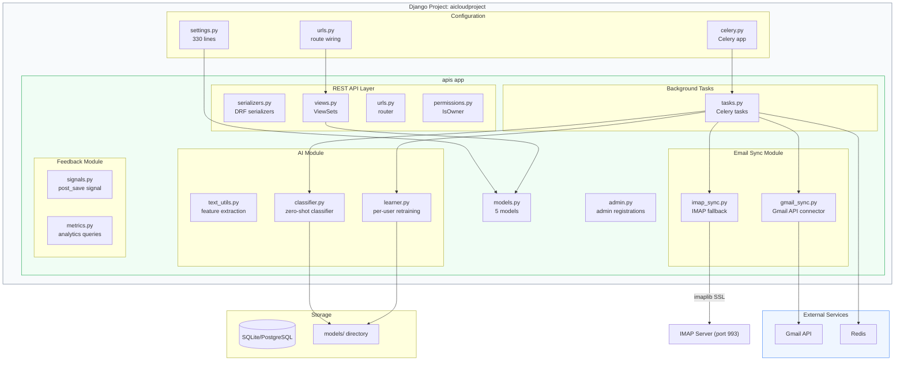
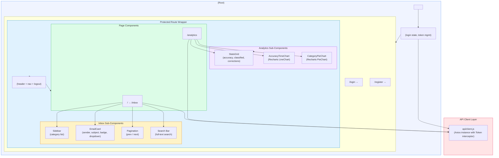
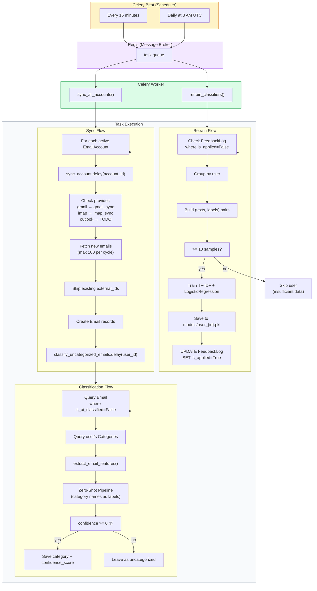
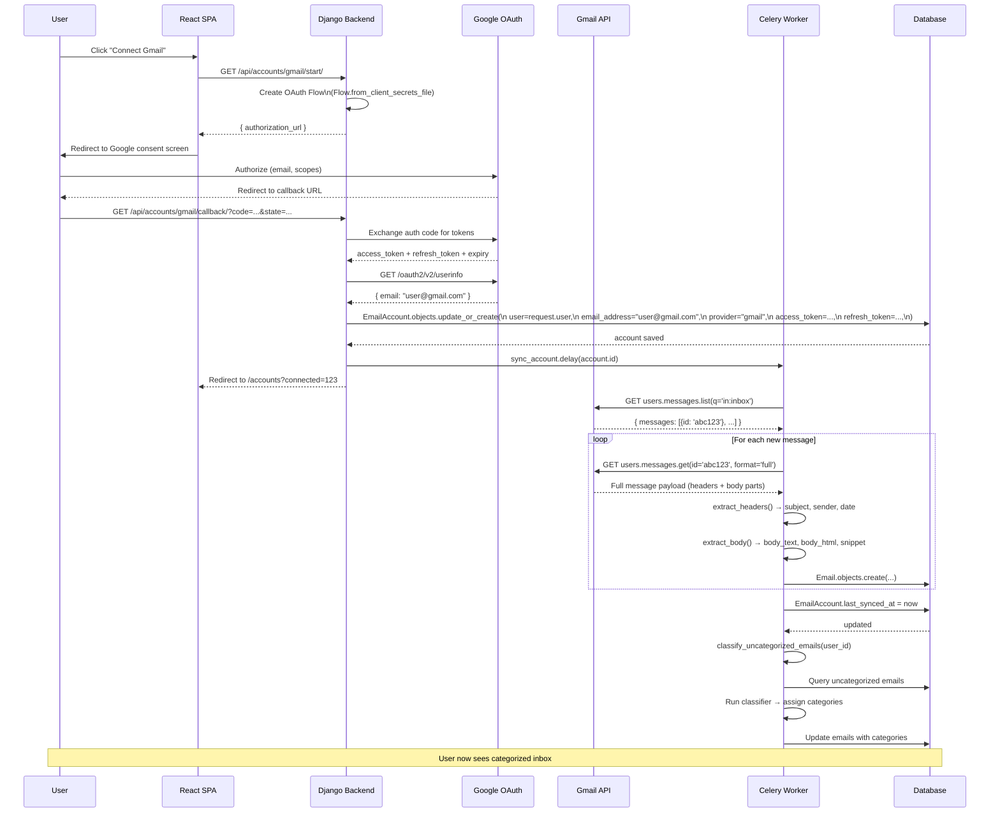

# CloudAI — System Architecture Diagrams

> Mermaid diagrams explaining the entire platform architecture, subsystems, and data flows.

---

## Table of Contents

1. [Overall System Architecture](#1-overall-system-architecture)
2. [AWS Cloud Deployment](#2-aws-cloud-deployment)
3. [AI Cognitive Agent Architecture](#3-ai-cognitive-agent-architecture)
4. [Email Data Flow (End-to-End)](#4-email-data-flow-end-to-end)
5. [Backend Component Architecture](#5-backend-component-architecture)
6. [Database Entity-Relationship Diagram](#6-database-entity-relationship-diagram)
7. [REST API Route Map](#7-rest-api-route-map)
8. [Frontend Component Tree](#8-frontend-component-tree)
9. [Celery Task & Scheduling Flow](#9-celery-task--scheduling-flow)
10. [Gmail OAuth & Sync Sequence](#10-gmail-oauth--sync-sequence)

---

## 1. Overall System Architecture

The platform is a 3-tier SaaS application deployed on AWS. Users access it through a web browser; the backend orchestrates email ingestion, AI classification, user feedback, and continuous learning.



---

## 2. AWS Cloud Deployment

Production infrastructure on AWS using containers (ECS Fargate), managed PostgreSQL (RDS), and automated CI/CD via GitHub Actions.



### AWS Services Used

| Service | Purpose | Estimated Cost |
|---|---|---|
| Route 53 | DNS management | ~$0.50/mo |
| CloudFront | CDN for SPA + static assets | ~$1/mo |
| ECS Fargate | Serverless Docker containers | ~$15-30/mo |
| ECR | Docker image registry | ~$0.10/mo |
| RDS (db.t3.micro) | PostgreSQL database | ~$15/mo |
| ElastiCache (t3.micro) | Redis + Celery broker | ~$13/mo |
| S3 | Static file storage | ~$0.10/mo |
| Secrets Manager | Secret storage | ~$0.40/mo |
| **Total** | | **~$45-60/mo** |

---

## 3. AI Cognitive Agent Architecture

The AI system is modeled as a **Cognitive Learning Agent** with three sub-agents forming a feedback loop, inspired by AI agent theory.



### Agent Theory Mapping

| Agent Theory Concept | CloudAI Implementation |
|---|---|
| **Performance Element** | `EmailClassifier` class — HuggingFace zero-shot pipeline |
| **Critic** | `detect_category_override` signal — `post_save` on `Email` model |
| **Learning Element** | `UserClassifier` class — TF-IDF + Logistic Regression per user |
| **Knowledge Base** | `FeedbackLog` table + `models/user_{id}_classifier.pkl` files |
| **Problem Generator** | Manual user corrections — the ground truth |
| **Performance Standard** | `confidence >= 0.4` auto-assign threshold |

---

## 4. Email Data Flow (End-to-End)

The complete journey of an email from a user's inbox through the entire pipeline, including the feedback loop.



---

## 5. Backend Component Architecture

Django project structure showing how modules are organized within the `apis` Django app.



### Module Dependency Map

```
tasks.py
  ├── gmail_sync.py → models.py
  ├── imap_sync.py  → models.py
  ├── text_utils.py (lazy import)
  └── classifier.py → models.py, text_utils.py
                     └── settings.py (CLASSIFIER_MODEL)

signals.py
  └── models.py (post_save on Email)

learner.py
  ├── models.py (FeedbackLog, Category)
  └── scikit-learn (TfidfVectorizer, LogisticRegression)

metrics.py
  └── models.py (Email, FeedbackLog)
```

---

## 6. Database Entity-Relationship Diagram

All 5 models and their relationships.

```mermaid
erDiagram
    User ||--o{ EmailAccount : "has many"
    User ||--o{ Category : "has many"
    User ||--o{ Email : "owns"
    User ||--o{ FeedbackLog : "generates"
    User ||--|| UserProfile : "extends"

    EmailAccount ||--o{ Email : "contains"

    Category ||--o{ Email : "classifies"
    Category ||--o{ FeedbackLog : "predicted_as"
    Category ||--o{ FeedbackLog : "corrected_to"

    Email ||--o{ FeedbackLog : "has feedback events"

    User {
        int id PK
        string username
        string email
        string password
    }

    UserProfile {
        int id PK
        int user_id FK "1:1 with User"
        string subscription_tier "free|pro|enterprise"
        bool sync_enabled
        int sync_interval_minutes "default 15"
        datetime created_at
        datetime updated_at
    }

    EmailAccount {
        int id PK
        int user_id FK
        string provider "gmail|outlook|imap"
        string email_address UK "(user, email)"
        string label
        text access_token
        text refresh_token
        datetime token_expiry
        string imap_host
        int imap_port
        string imap_username
        string imap_password
        bool imap_use_ssl
        datetime last_synced_at
        bool is_active
        datetime created_at
        datetime updated_at
    }

    Category {
        int id PK
        int user_id FK
        string name
        string slug UK "(user, slug)"
        string color "#6B7280"
        string icon
        bool is_builtin
        int display_order
        datetime created_at
    }

    Email {
        int id PK
        int user_id FK
        int email_account_id FK
        int category_id FK "nullable"
        string external_id "provider message ID"
        string thread_id
        string sender_name
        string sender_email
        string recipient_email
        string subject
        datetime received_at
        text body_text
        text body_html
        string snippet "300 chars"
        float confidence_score "0.0-1.0"
        bool is_ai_classified
        bool is_read
        bool is_archived
        datetime created_at
        datetime updated_at
        index "(user, category)"
        index "(user, received_at)"
        index "(external_id)"
    }

    FeedbackLog {
        int id PK
        int email_id FK
        int user_id FK
        int predicted_category_id FK "nullable"
        int corrected_category_id FK "nullable"
        string email_subject
        string email_sender
        string email_snippet
        bool is_applied
        datetime created_at
        index "(user, is_applied)"
    }
```

### Key Relationships

- **User → UserProfile**: One-to-one (SaaS extension)
- **User → EmailAccount**: One-to-many (multiple inboxes)
- **User → Category**: One-to-many (per-user category list)
- **User → Email**: One-to-many (all owned emails)
- **EmailAccount → Email**: One-to-many (emails from one inbox)
- **Category → Email**: One-to-many (classification)
- **Email → FeedbackLog**: One-to-many (correction history)
- **FeedbackLog → Category (x2)**: Predicted vs corrected

---

## 7. REST API Route Map

All API endpoints organized by resource, with authentication requirements and method access.

```mermaid
graph LR
    subgraph Auth["Authentication (dj-rest-auth)"]
        Login["POST /api/dj-rest-auth/login/"]
        Register["POST /api/dj-rest-auth/registration/"]
        Logout["POST /api/dj-rest-auth/logout/"]
        PwdReset["POST /api/dj-rest-auth/password/reset/"]
    end

    subgraph Profile["User Profile"]
        ProfileGET["GET /api/profile/"]
        ProfilePUT["PUT /api/profile/{id}/"]
    end

    subgraph Accounts["Email Accounts"]
        AcctList["GET /api/accounts/"]
        AcctCreate["POST /api/accounts/"]
        AcctDetail["GET /api/accounts/{id}/"]
        AcctDelete["DELETE /api/accounts/{id}/"]
        AcctSync["POST /api/accounts/{id}/sync/"]
    end

    subgraph Categories["Categories"]
        CatList["GET /api/categories/"]
        CatCreate["POST /api/categories/"]
        CatUpdate["PUT /api/categories/{id}/"]
        CatDelete["DELETE /api/categories/{id}/"]
    end

    subgraph Emails["Emails"]
        EmailList["GET /api/emails/"]
        EmailDetail["GET /api/emails/{id}/"]
        EmailUncat["GET /api/emails/uncategorized/"]
        EmailCatChange["PATCH /api/emails/{id}/category/"]
        EmailBatchCat["POST /api/emails/batch_categorize/"]
    end

    subgraph Feedback["Feedback"]
        FBList["GET /api/feedback/"]
    end

    subgraph Analytics["Analytics"]
        AnSummary["GET /api/analytics/summary/"]
        AnTimeline["GET /api/analytics/timeline/?days=30"]
        AnDistribution["GET /api/analytics/distribution/"]
        AnPending["GET /api/analytics/feedback_pending/"]
    end

    Login -->|get token| Emails
    Login --> Categories
    Login --> Accounts
    
    style Auth fill:#dbeafe,stroke:#2563EB
    style Emails fill:#dcfce7,stroke:#16A34A
    style Analytics fill:#fef3c7,stroke:#D97706

    linkStyle 0,1,2,3 stroke:#94A3B8,stroke-width:1
```

### Endpoint Summary

| Group | Count | Auth | Description |
|---|---|---|---|
| Auth | 4 | No | Registration, login, logout, password reset |
| Profile | 2 | Yes | Read/update own profile |
| Accounts | 5 | Yes | CRUD + manual sync trigger |
| Categories | 4 | Yes | CRUD (built-in protected from delete) |
| Emails | 5 | Yes | CRUD + category change + batch categorize |
| Feedback | 1 | Yes | Read-only correction history |
| Analytics | 4 | Yes | Accuracy, timeline, distribution, pending |
| **Total** | **25** | | |

---

## 8. Frontend Component Tree

React component hierarchy showing page structure, context providers, and component relationships.



### Frontend Dependencies (package.json additions)

```
react-router-dom   →  Client-side routing (protected routes, navigation)
axios              →  HTTP client with token interceptors
recharts           →  Line charts (accuracy timeline) + Pie charts (distribution)
```

---

## 9. Celery Task & Scheduling Flow

How background tasks are scheduled, dispatched, and executed.



---

## 10. Gmail OAuth & Sync Sequence

Detailed sequence diagram for connecting a Gmail account and the initial sync.


